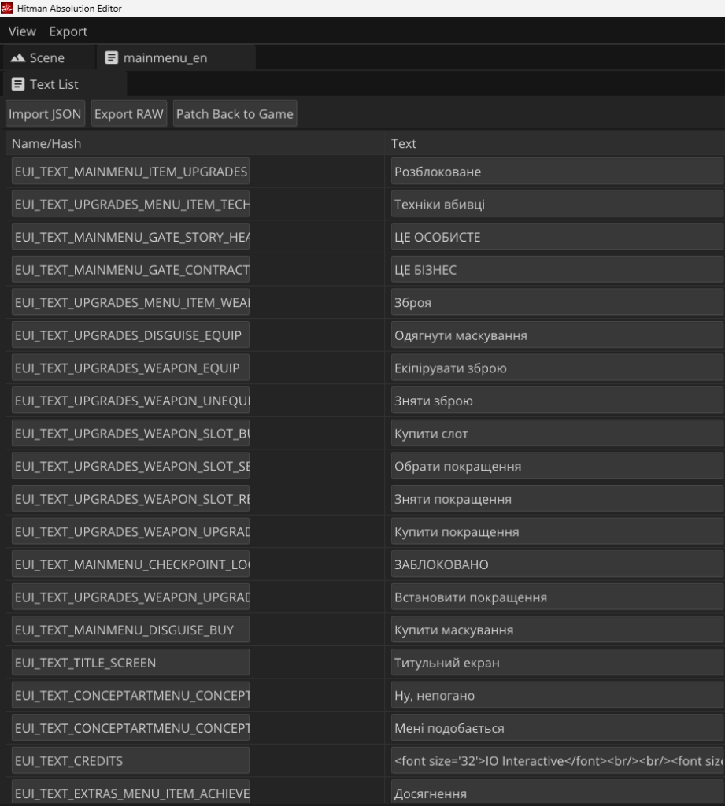
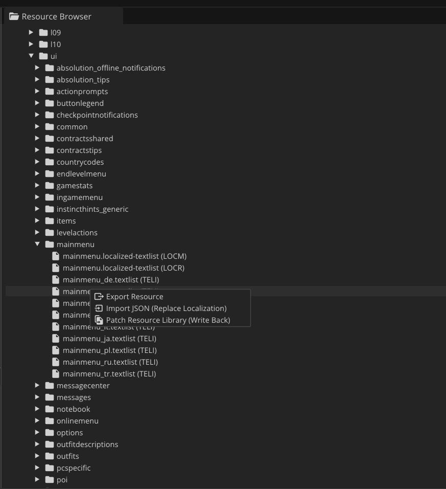
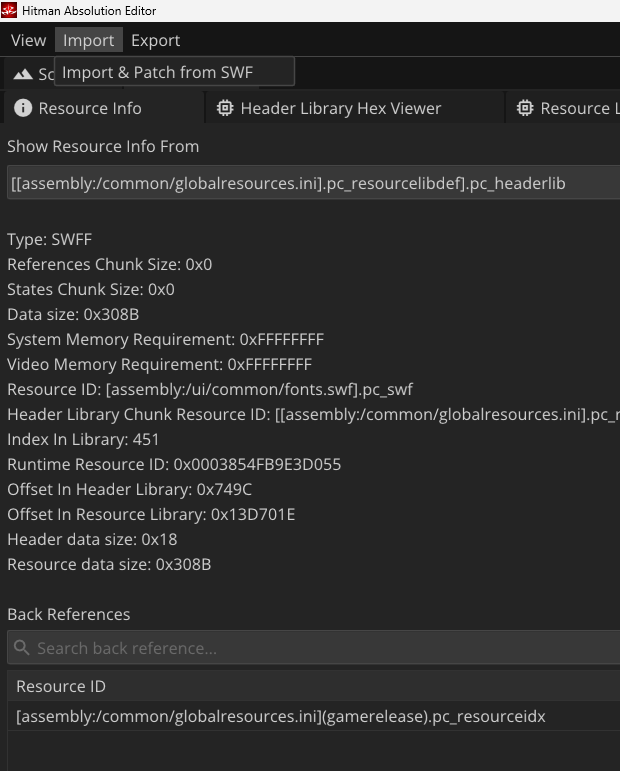

# Hitman Absolution Editor (Форк для локалізації)

*[Read this in English](README.md)*

Цей проект є форком оригінального **Hitman Absolution Editor**. Основна мета цього форку — додавання повноцінної української локалізації в гру *Hitman: Absolution*.

Оригінальний інструмент дозволяв лише розпаковувати та **переглядати** ігрові ресурси, але не підтримував їх зміну. У цій версії ми реалізували повноцінне **редагування шрифтів та ігрових текстів**, а також додали підтримку кирилиці та інструменти для масового перекладу!

## Скріншоти

## Що було додано та змінено:

- **Глобальний глибокий пошук (Deep Search):** Додано можливість шукати будь-який текст (наприклад, "English" або "люблю") одразу по всіх 16 000+ файлах гри у фоновому потоці без зависання інтерфейсу.
- **Редагування ресурсів:** На відміну від оригіналу, цей форк дозволяє імпортувати та зберігати змінені тексти та шрифти назад у файли гри (Patch Resource Library Write Back).
- **Підтримка кирилиці в редакторі:** Інтерфейс редактора (через ImGui) тепер коректно відображає українські та російські літери як у результатах пошуку, так і в самій панелі читання текстів.
- **Виправлення критичних багів пам'яті:** Полагоджено `Undefined Behavior` у роботі з виділенням пам'яті для масивів ресурсів, що викликало вильоти програми (heap corruption) при масовому скануванні файлів.
- **Безпечний подвійний клік:** Усунуто баг, коли подвійний клік на непідтримуваний або невідомий тип ресурсу призводив до падіння редактора через Null Pointer Exception. Тепер редактор безпечно ігнорує такі файли, попереджаючи у консолі.
- **Іконка програми:** Додано кастомну іконку Хітмена до виконуваного файлу та вікна програми.

## Як зібрати проект (Build)

1. Клонуйте репозиторій.
2. Переконайтесь, що у вас встановлено **Visual Studio 2022**, **CMake** та **vcpkg**.
3. Запустіть скрипт `build.bat` у кореневій папці проекту.
4. Після успішної компіляції готовий `HitmanAbsolutionEditor.exe` з'явиться у папці `build/x64-Release`.

## Про ліцензію та авторське право

Цей проект базується на оригінальному Hitman Absolution Editor, який **не має явної відкритої ліцензії** (no license). 
За правилами GitHub (Terms of Service), публікуючи код, автор дозволяє іншим користувачам переглядати його та створювати форки (fork) всередині платформи GitHub. 
Однак, відсутність ліцензії означає, що **ви не маєте права використовувати цей код у комерційних цілях або розповсюджувати його як свій власний**. 
Цей форк створено виключно з некомерційною метою (переклад гри українською) у рамках Fair Use та умов використання GitHub.
